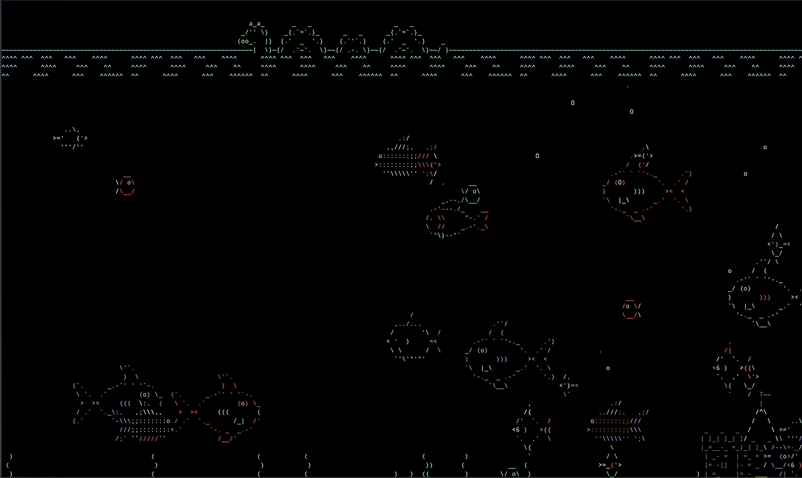

## Ascii Aquarium

I'm a big fan of ASCII art, and seeing a live ASCII aquarium makes me ponder how much time people are willing to dedicate to projects that only a few dozen people enjoy.

👨‍🦳 Fun Fact: This project is very old and written in PERL

What's really fascinating is that the aquarium has `layers`, so when the fish swim over other objects, they have their own z-axis 😮

🔗 [asciiaquarium](https://github.com/cmatsuoka/asciiquarium)

