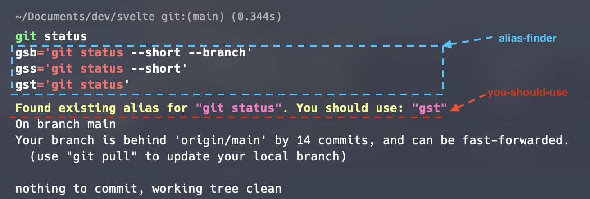
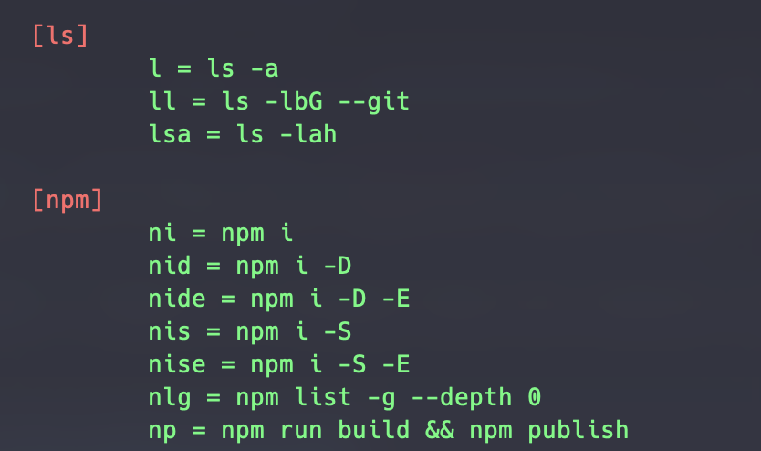

## You-Should-Use & Alias Finder

🔗 [you-should-use](https://github.com/MichaelAquilina/zsh-you-should-use?ref=catalins.tech)

🔗 [alias-finder](https://github.com/ohmyzsh/ohmyzsh/tree/master/plugins/alias-finder)

🔗 [aliases](https://github.com/ohmyzsh/ohmyzsh/tree/master/plugins/aliases)

🔗 [git](https://github.com/ohmyzsh/ohmyzsh/tree/master/plugins/git)

It’s quite helpful if you’re as scatterbrained as I am

`you-should-use` displays the **existing** aliases, and through repetition, you will eventually memorize them all 🧠.

The `alias-finder` shows all aliases that are similar to the command you are using.

## Aliases

Another plugin related to aliases! Wow, aliases must be important to shell users, huh?

Anyway, the `aliases` plugin adds useful aliases to display other aliases, making it easy for you to see all your aliases?. If that sounds good to you, you'll be happy with this plugin.

This is what the docs say:
- `als`: show all aliases by group
- `als -h/--help`: print help message
- `als <keyword(s)>`: filter and highlight aliases by <keyword>
- `als -g <group>/--group <group>`: show only aliases for group <group>. Multiple uses of the flag show all groups
- `als --groups`: show only group names

For example, listing all aliases via `als` shows following:

☝️ and many more

👇 and many more

## Git

The `git` plugin adds Git aliases, allowing you to save some keystrokes here and there.

