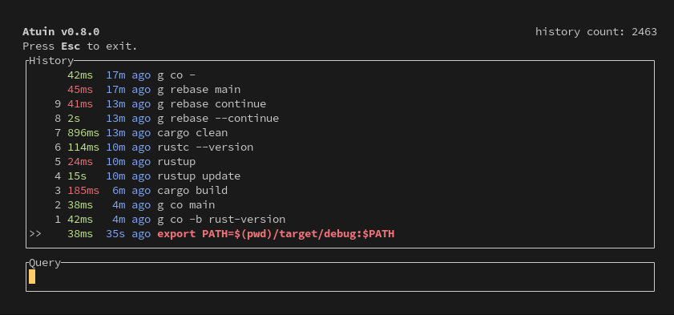

## Atuin  

The `atuin` plugin shows fuzzy history 🐢

🔗 [atuin](https://github.com/atuinsh/atuin)



My custom aliases:

```sh
alias h="atuin search -i" #interative history search
alias hf="atuin search --exclude-exit 0 -i" #failed commands
```
