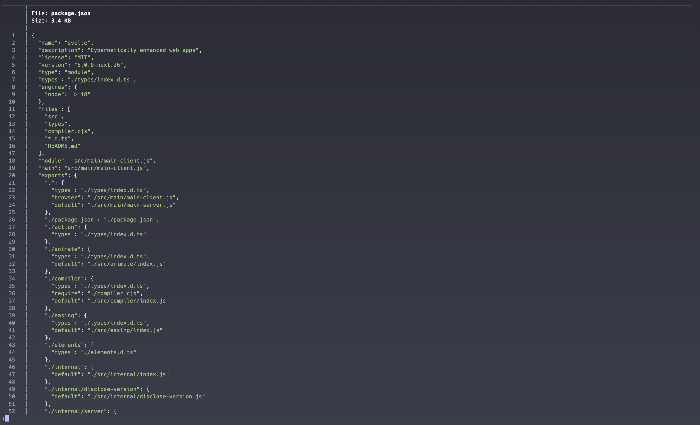

## bat

🔗 [bat](https://github.com/sharkdp/bat)
🔗 [zsh-bat](https://github.com/fdellwing/zsh-bat)

The `bat` plugin pretty prints files into the console, so you don't have to mentally syntax highlight anymore 🎨



I configured `bat` to use theme and style (default is `full`)
```sh
alias bat="bat --theme=OneHalfDark -pn --style='full'"
alias cat="bat"
```
