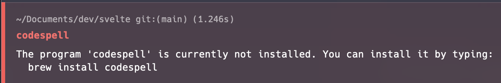

## command not found 

🔗 [command-not-found](https://github.com/ohmyzsh/ohmyzsh/tree/master/plugins/command-not-found)

This plugin assists with commands that are not found or installed on the system. It's designed specifically for MacOS

