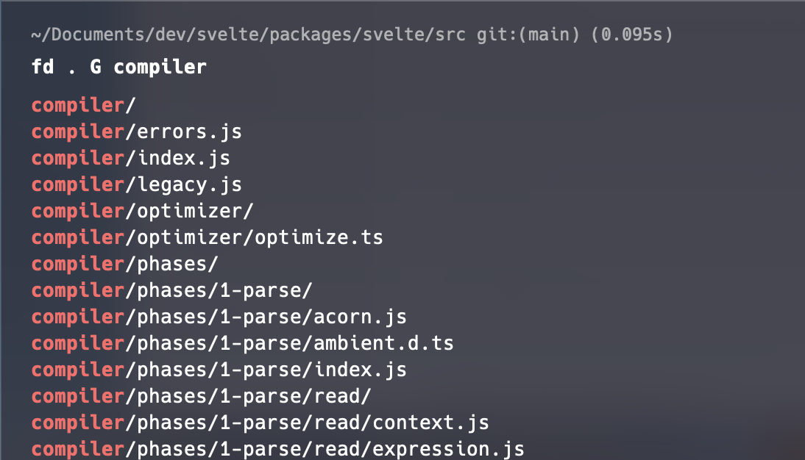

## Fd 

🔗 [fd](https://github.com/sharkdp/fd)

Although I don't use this extension that much, it really helps with finding shit around your filesystem. It can be used to search for virtually any file

Example usage:


It pairs nicely with my custom global `grep` alias `G` like this:

```sh
grep='grep  --color=auto --exclude-dir={.bzr,CVS,.git,.hg,.svn}'
alias -g G='| grep -i'
```

Usage:



## fd-zsh

🔗 [fd-zsh](https://github.com/MohamedElashri/fd-zsh)

In addition to `fd`, I use the `zfd-zsh` plugin, which adds a bunch of helpful aliases to `fd`.

| Alias | Command            | Help                                                     |
|:-----:|:------------------:|:--------------------------------------------------------:|
| fd    | fd --color always                | Always colorize output by default |
| fd_details     | fd  --list-details            | list details                                          |
| fd_ext    | fd --extension             | Filter by file extension, insert <extension> after this command                                                |
| fd_name   | fd --glob | Filter by file name (default: regular expression)                    |
| fd_case    | fd --ignore-case    |  Search hidden files and directories                                                 |
| fd_abs    | fd --absolute-path   | Show absolute instead of relative paths                                    |
| fd_exec  | fd --exec         | Execute command for each search result                                                |
| fd_execlude    | fd --exclude             | Exclude files and directories that match the given glob pattern <pattern>                                 |
| fd_size    | fd --size    |  SFilter by file size (insert <size> after this command)                                                 |
| fd_owner    | fd --owner    |  Filter by file owner (insert <user:group> after this command)                                                 |
| fd_symbolic    | fd --follow    |  Follow symbolic links                                                 |
| fd_version    | fd --version    |  Show version information                                                 |
| fd_help    | fd --help    |  Show help message                                                 |

