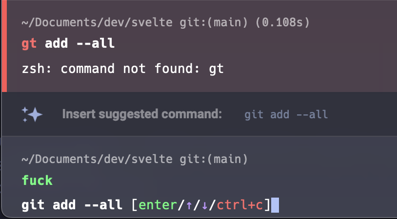

## The Fuck?!

How accurate are you at spelling? I'm pretty bad. Sometimes I just want to scream "fuck," but people wouldn't understand the pain of misspelling shell commands.

The fuck plugin corrects you when you misspell a command, and you can even swear in your console to trigger it. This plugin really improves quality of life.

You can see that `Warp` understood the mispelling and tried to help me out (`Insert suggested command: git add --all`), but there is no cursing involved. Pass 🤬 ! 
